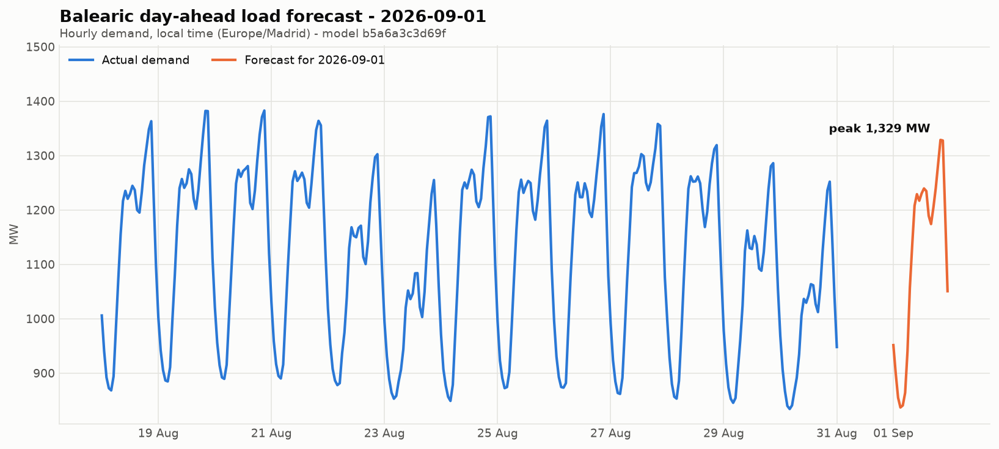

# balearic-load-forecast

Day-ahead hourly electricity demand forecasting for the Balearic electric
system. Work in progress.

LightGBM over calendar, lagged-demand and temperature features, trained on
REE's hourly series from 2011. On a 90-day held-out tail: **23.1 MW MAE
(2.1% MAPE)**, against 31.4 MW for a seasonal-naive baseline.



## Setup

```bash
uv sync
```

## Running

```bash
uv run python -m balearic_load_forecast <job>
```

| Job | Does |
| --- | --- |
| `backfill` | Fetch demand history from REE |
| `weather` | Fetch temperature history and forecast from Open-Meteo |
| `train` | Fit a model, score it, save it |
| `predict` | Forecast tomorrow and store it |
| `evaluate` | Score stored forecasts against actual demand |
| `visualize` | Plot the newest stored forecast |

First run needs `backfill` and `weather` before `train`. After that, run
`backfill weather predict evaluate visualize` daily and `train` weekly.

With [mise](https://mise.jdx.dev): `mise run daily`, `mise run retrain`,
`mise run all`.

## Configuration

`confs/<job>.yaml`, overridable on the command line:

```bash
uv run python -m balearic_load_forecast train model.num_leaves=127
uv run python -m balearic_load_forecast predict target_day=2026-09-05
```

## Layout

```
src/balearic_load_forecast/
    domain/       features, models, metrics (pure)
    io/           HTTP, disk, logging
    application/  one run(config) per job
    settings.py   config schemas
    scripts.py    CLI
```

Outputs go to `outputs/` and are not tracked.

## Development

```bash
uv run pytest
uv run ruff check .
uv run ty check
```

## Data

- Demand: [REE](https://apidatos.ree.es), `geo_ids=8742`, published ~1 day
  behind.
- Temperature: [Open-Meteo](https://open-meteo.com), Palma de Mallorca.
  ERA5 for history, forecast endpoint for the days ahead.

## License

MIT.
